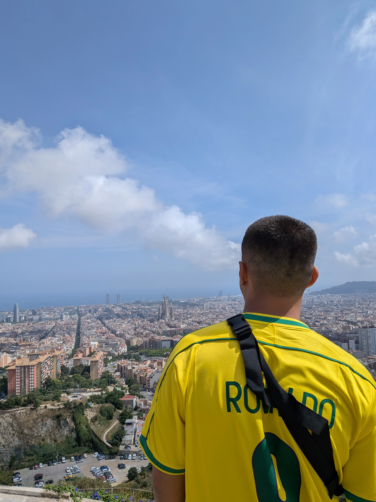

## Introduction
Barcelona was the reason for my entire Eurotrip. Initially, my father, my brother, and I were going to Cusco for a week at the end of June to see family and hike the short "Camino Inca," but then a professor from Barcelona who had researched with my mom said that a congress was going to happen at the beginning of June, and they were going to reserve a time to honor her work and projects.

Luckily, I had the exact time off from work to attend the congress and later meet my family in Cusco. And so, the 3-week trip from Europe to Peru began.

## Congress
The congress, along with the short Inca Trail in Peru, was the only fixed appointment I had during the entire vacation. I could (and wanted) to change destinations, hostels, tours—whatever—but I had a responsibility to attend those two.

It was the [Arquitectonics](https://www.arquitectonics.com/congreso-2025), based in the Universitat Politècnica de Catalunya. Half an hour of the congress was dedicated solely to the memory of my mom, with her students from Brazil presenting projects in her research field.

It was beautiful to see all the students gathering on the video call to attend the presentations. Before the presentations started, the professor gave me the microphone to say a few words.

## Nightlife 

People always said that Barcelona was the spot for nightlife during a European summer, and indeed it was. Kudos to my hostel, Onefam, which every day, Monday to Monday, had a scheduled tour around noon, and then bars and clubs at night.

During my stay in Barcelona, from Wednesday to Sunday, I went to the assigned bar and club every day. It was mostly Europeans and other foreigners like me enjoying the summer. It was a great vibe, but the music was not that good—mostly 2010s EDM.

One of the nights that has a special place in my memory was when we went to a club on the beach. I don't remember its name. It was a nice party, but what happened afterward was really cool.

At the end of the party, I was with a Brazilian, an American, and a Brit; we all met at the hostel. By like 3 a.m., we decided it was time to go back to the hostel, and I suggested, "Well, since we're here at the beach, we should at least take a walk along the shore." We all agreed, and in the end we went for a swim in the Mediterranean Sea and got a bus/taxi back to the hostel while soaking wet :)

## Costa Brava and Pride
The start of this trip was great to engage with a different perspective on life, in the sense that I was totally disconnected from my problems and just fully enjoying the moment. I never had so much disposition in my life, and Costa Brava was a great example of that.

I was taking a flight to Italy on Monday at ~7 a.m. So, when I got back to the hostel at 4 a.m. on Sunday, I was lying on the lobby's couch and thought, "Well, today is my last day. How should I enjoy it?" Then I remembered a Brazilian friend I'd met at the hostel telling me she went kayaking in Costa Brava and that it was one of the most beautiful landscapes she had ever seen. I decided I should go for it.

I opened a few websites to schedule a tour, found one for 10 a.m., reserved and paid for it, and was about to go to sleep. Then I had a thought: "Well, let's check where and when I need to be." That's when I realized that Costa Brava was a region ~80km north of Barcelona, there was no bus service there, and the meeting point was at the location itself :)

So at 4:30 a.m., I reserved a rental car for 8 a.m. at the airport. The plan was to wake up at 7 a.m., get an Uber there, and then drive ~1 hour to Costa Brava to kayak for 2 hours :)

It was a really cool experience, and when I got back to Barcelona, people at the hostel were getting ready for a Pride parade that was an hour south of Barcelona, and, well, I just went with them to fully enjoy my last day in the city.

