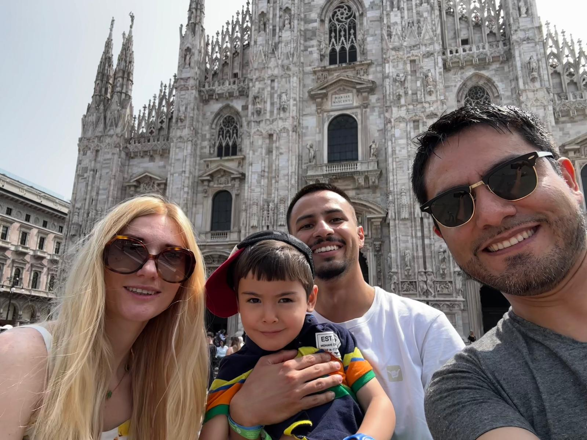
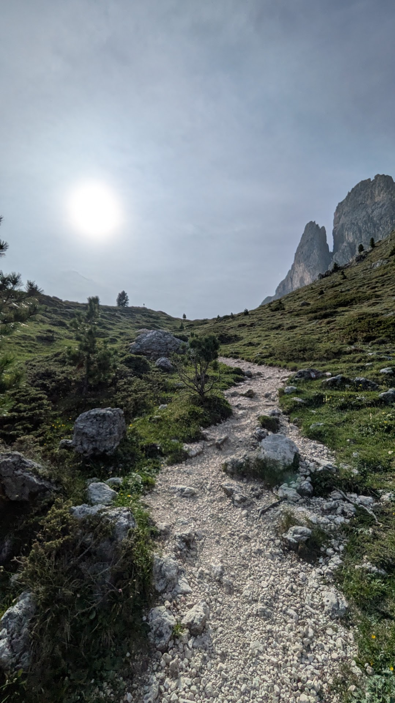
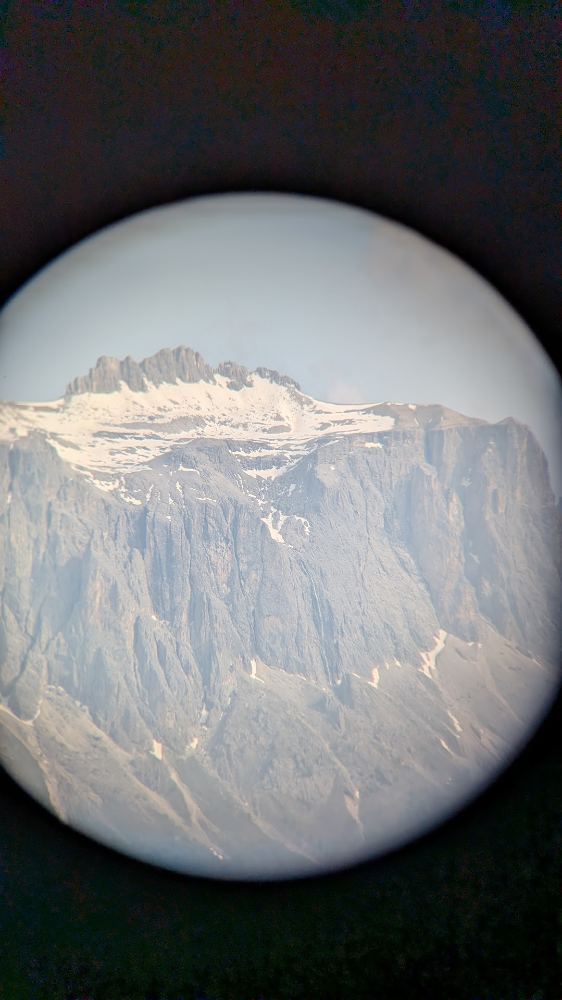
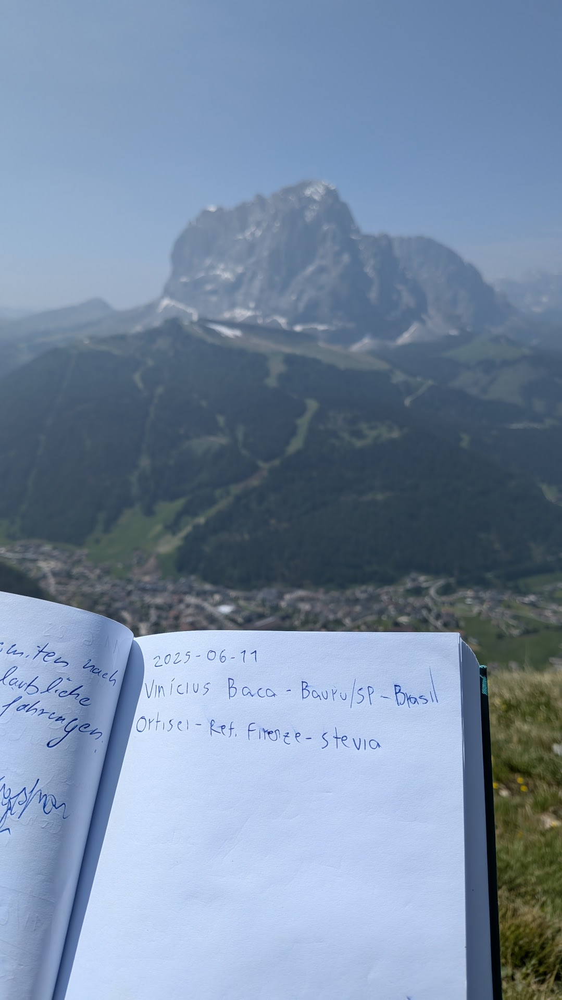
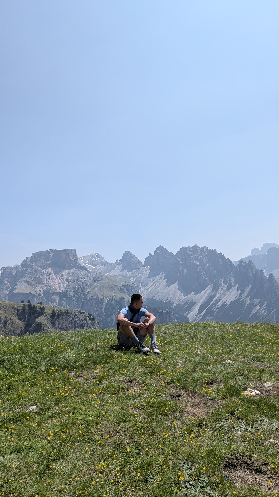
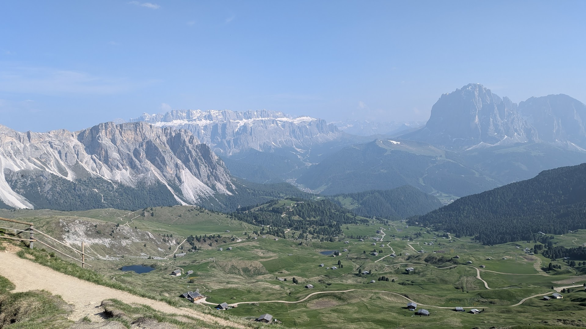

## Introduction
Dolomites, the mountains at the north of Italy, was the destination I was most excited for. It is a ski point by the winter, and a hiking one by the summer.

I was already hyped for it since I started to plan everything, and then, a week before the trip started, I was talking about books with a friend of mine and the theme of my favourite book rose. My favourite one is [The Eight Mountains] (https://en.wikipedia.org/wiki/The_Eight_Mountains_(novel)) , a book about the life of an Italian boy whose parents are frustrated with the city life and always go back to the mountains, that I've read ~6 years ago. After this conversation, I started reading it again (after a long time) and I realized that the mountains that the family always go back to are the Dolomites :)

## Arriving in Italy and preparing
I left Barcelona on a Monday morning, departing from the Barcelona airport and arriving at Milan's MXP, where my cousin Michael was going to pick me up with his wife Evgenia and their little boy, Adrian. They all took the day off so they could drive me around Milan (thanks, that was very kind), and show all the city spots. It is a beautiful city, and a business center that I wasn't aware of. We also went to the Como Lake, and every piece of grass or car trip that I seated for more than 5 minutes I ended taking a nap with my little nephew to recover from the Barcelona intense days.

By the end of the day we went back to their house, so that I could sleep well and start my Dolomites journey by the morning. 

While some colleagues that I met further in the hiking took some months watching videos, searching about the paths etc. I just asked Gemini what would be pertinent to do there, and clicked on some source links. The thing that I learned about the Dolomites is that there are some “Rifugios” over the park that are only reachable by hiking in the mountains, and then you reserve a Rifugio for a day, and in the next one you reserve another and your plan for the day will be of hiking from one into another, while enjoying the view and visiting whatever interests you in the route.

So on Tuesday, the beginning of my Dolomites day, I woke up by 5am and needed to take a train from Milan unit Bozano, and a bus from Bozano to the closest city to my rifugio. Surprisingly everything went well, I didn't lose any belongings nor a train/connection.

We had a beautiful sightseeing in Milan, and also went to Lago Colmo near it, and every time we stopped in a bench or was riding somewhere, I took the opportunity to sleep and recover from the intense Barcelona days, and that was indeed needed, as in the next day I would start the hiking trip.

At the end of the day, Evgenia prepared a delicious risotto and I started packing my stuff for the incoming 3-day hike. I still needed to figure out how I would get there, as I only had the reservations for the Rifugio Firenzi (https://www.rifugiofirenze.com/en/) for two nights and the website said that I could get there by hiking from a town called Oritisei. But I had no idea how I would get to Ortisei. 

After some googling and talking with Michael, I figured that I only needed to take a train from Milano Centrale to a town called Bozano, and there get a bus to Ortisei. The next day I woke up at 6am to start the trip and, surprisingly, everything worked out smoothly. All the connections ended up fine with some spare time, and by 12pm I was in Ortisei with a small breakfast (2 croissants) done at the train station.

## Milan -> Dolomites
The only part that I didn't think about very well was the start of the hike, as I needed to start to walk right at the hottest hour of the day, and unhopefully, it was very sunny with no clouds the entire way. 

Those small cities, such as Ortisei, seemed like it was from a fairy tale book. It had only small cottages, happy people hosing the gardens, kids playing outside, and everything seemed to work really well. I hopped out of the bus and set Google Maps to give me some directions until the Rifugio, and I also added a stop at the Chiesa di San Giacomo, an old church by the woods that looked interesting and wouldn't change much of the route.

After 20min walking, the route changed from a paved road into some trailpath in the woods, and then I didn't need the Maps anymore, as there were a lot of signs in the path pointing to many landmarks nearby, and once that I was following only the church route it also became a trail in the middle of the woods.

## Small Church
After 1h of the trail I got into the church and it was pretty okay, worth of a 5min look-around and then I went back to my route to the Rifugio. After walking for some time I found a sign that pointed the direction and that it would take 3h to get there, and then I kept going.

Then the trail started to get gorgeous, better than in the pictures I've seen before. The path was very clear and picturesque, such as this in the photo below. The parts in the route that didn't have any trees around, I could see the snowy mountains all along.

With only 1h30 left of hiking towards the Rifugio, it started to be a strong uphill, and there was the option of using a cable car to get nearby, but the idea of climbing the hill was way cooler. When it was 1h into the Rifugio, I stumbled with the hut below. 

## Best view in my life
It was maybe 14:30 and I didn't have any lunch yet, only the croissants from the train, so it seemed a good idea to take a break there. First I took a seat inside the cozy hut, I think that I was tired or just needed a better place to sit, because looking back I can't understand why I would miss a single minute of sitting outside with such a view. 

Before I ordered the meal I asked to change the table for an outer one, and it was the best view I ever had in my life, even more than Laguna Humantay or Lençóis Maranhenses. I was stunned, and since there was wifi there, I started some video calls with a lot of family and friends to tell my journey so far and show them the full view I was enjoying. 

And, surprisingly, things still got better. I ordered a “Hunter's Pasta”, which is a pasta with ragu, tomato sauce and some vegetables, and an orange juice to refresh, besides being quite hungry I'm pretty sure that it was a top notch meal anyway, even more with the big parmesan cheese dispenser I had in the table.

After finishing the meal and talking with everyone, I took some time laying in a sofa outside and had a long conversation with Pedro, which I don't remember what we talked about, but was great to catch up with a closer timezone for the first time .

 
<video width=100% controls autoplay>
    <source src="nice_view.mp4" type="video/mp4">
    Your browser does not support the video tag.  
</video>


## The Rifugio
Once that I felt that I could continue the hiking, I asked the direction for the waitress and kept walking, and it was more 40min of uphill to get there. While I was walking, some people passed by right above me through the cable cars. I was certain that hiking is way cooler, but I can't deny that the view above must be insane.

After the promised 40min of uphill, I could see the Rifugio Firenze in all its glory. It was a very cozy hut with some space for chilling outside and very friendly waitresses inside to help with the accommodations and routes along the park. 

As I arrived by the evening at the Rifugio, the waitress told me that the dinner would be soon so I just went upstairs for a quick bath and changed my clothes so I could have some food without being in pure dirt and sweat. 

When I went for the dinner, one of the tables at the restaurant lobby had my name in a little sign near the plate, and there was just one more person in the table, a blonde girl by my side with the little sign in front of her that had “Florentine” written on it. I just said hi and had my seat at the table.

There were 4 more signs at the table, and a small basket of bread that I started smashing right away. After some time another girl got by the table and took her seat with us, her name was Naya and also just said hi and started looking at the menu. Then another girl arrived and sat there, but instead of saying hi, she grabbed her sign, showed it to us and said “Hi, Oriane”. And I have no clue why, but it was enough that everyone showed their signs and presented them at the table, mostly saying their name and country. 

At the end of the presentations, Oriane is French, from a city near Paris. Laia is Spanish, born in Barcelona and now living near the city. And Florentine is German, living in Berlin, which she said is the coolest city in the world. 

It seemed that the restaurant arranged the signs at the table in a way that was easier for everyone to integrate, and that our table was the ~25 years old one. Pretty soon our table was chatting about its own eurotrip, differences with the homeland and ideas for hiking the next day. 

## Full hiking day
By the next day, only me and the french girl still would stay in the Rifugio, as all the others would leave back to their country or to another rifugio, so it made sense for everyone to follow their paths and me and the frenchie hang out together through the dolomites. We chose our route mainly by the suggestion of the local that worked in our rifugio and gave tips for everyone, he told us where would be nice and that we could find some snow (that was one of my must haves).

We started the hike by 10am and it was a pretty rough uphill by the beginning, and by some time me and the frenchie split away as she told me to go ahead while she would take some rest. When I got to the top of our hill I took a seat on a majestic bench and waited for her. After like 30 minutes she didn’t show up and I supposed that she just went back to the rifugio (as other tourists did) and I followed along the trail. Some time after this I found one of the landmarks that would be in this trail, a christ engraved in wood on the top of another hill, and then I took some rest and enjoyed the sun for some time.

And then, from nowhere, the frenchie showed up. She said that she had altitude sickness and was feeling bad for some time back on the trail, and that’s why she took so long to follow the hike. I felt kinda bad for leaving her alone by this time, but she said that was all cool and she wanted to keep hiking and finish the trail as a challenge. While we took a rest by this landmark we also took some pictures (it’s really hard to take cool pictures alone on a trail), and she got one of my favorite shots of the entire trip.

This was like 2pm and we followed the hike until 4pm IIRC, and when we got back into the Rifugio, she wanted to rest and I wanted to go to another important point near the Rifugio, where I went in a trail running vibe for the sport.

## Leaving
By the next day me and the frenchie agreed to go together back to Ortisei, as I needed to take the train back to Milan and she a bus to Cortina (another Dolomites city), and then after the breakfast we started our path downhill until the city, it was a pretty straightforward walk and way easier, as we were just going uphill those days. When we got to the bus point my bus to the train station just arrived and I got back to Milan.
