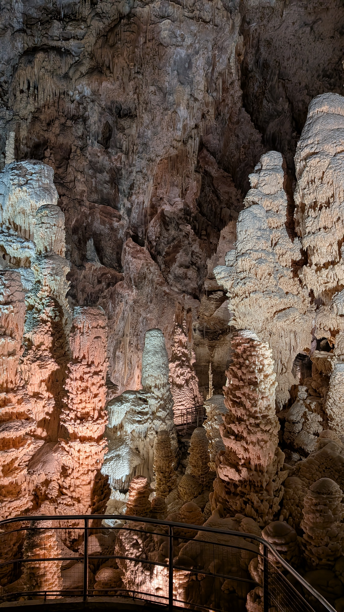

## Back to Milan
The day I got back to Milan, I just arrived in the Milano Centrale train station and went for a quick hop at 
the Google office in Milan to get some snacks and then back to Michael's house, arriving there we already got 
our stuff packed and went to Marche.

## Pizza on the road to Ancona
Marche is a region to the Central East of Italy, right by the Adriatic Sea and approximately 4 hours from Milan by car.
Our trip started by late afternoon, and in the middle of the trip we got hungry and decided to stop by a local pizza 
place in a random city on the road. It was a really local pizza place and a great memory of getting a traditional 
pizza in Italy. 

After the pizza we travelled 2 more hours and got into my cousin's Cielo country house in Ancona.
Ancona is the capital of the Marche region and is right by the beach, where my cousin and her husband live and have 
a family's farm house that they carefully prepared for us. As we got pretty late we just prepared for the next day 
and got some sleep.

The next day my other cousin (at some moment a cousin of my mom moved to Italy, build her life there and their kids also started their life there) picked me up for a tour to the Grotte di Frasassi, which is a really cool cave nearby Ancona.
The thing there is that is *really* a cave, like the you walk a man-made tunnel for 30 meters just to get into the 
beginning of the cave system, which is full of chambers and stalactites (stalagmites?), very movie stuff.

