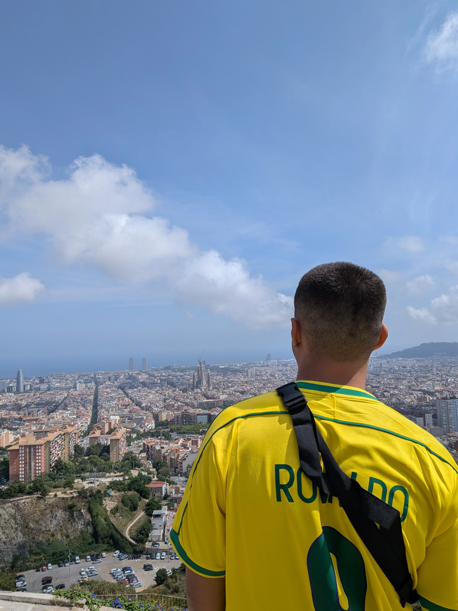
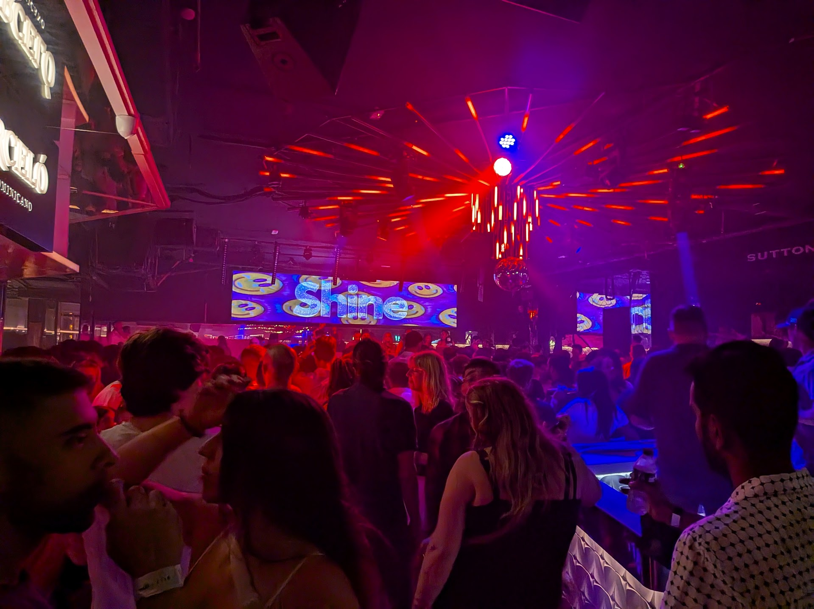
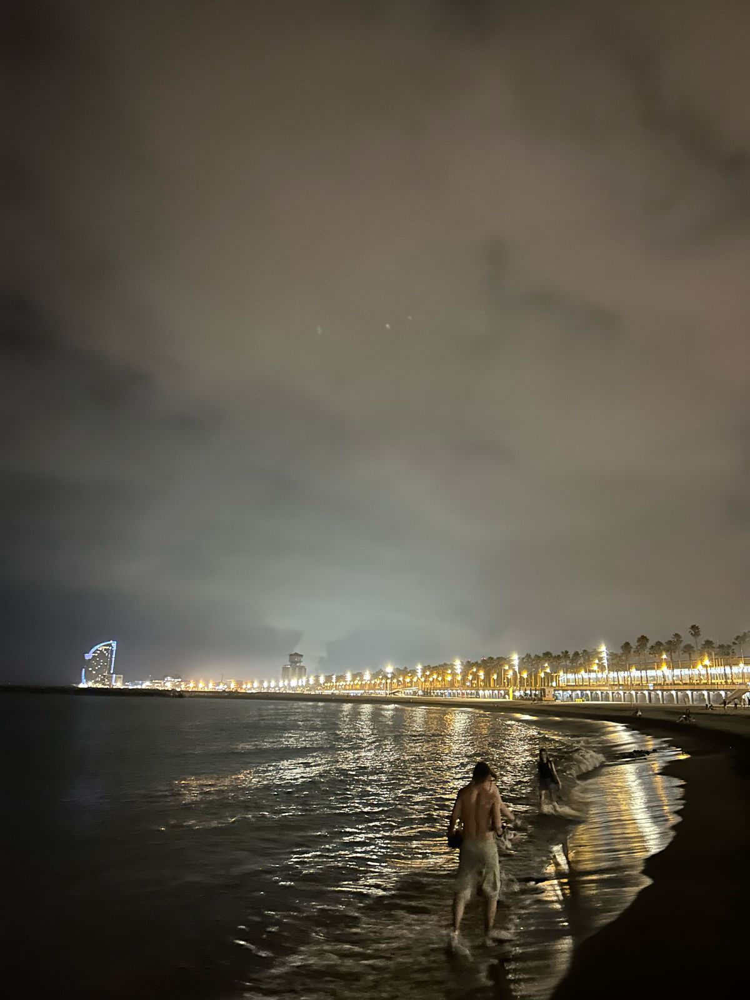
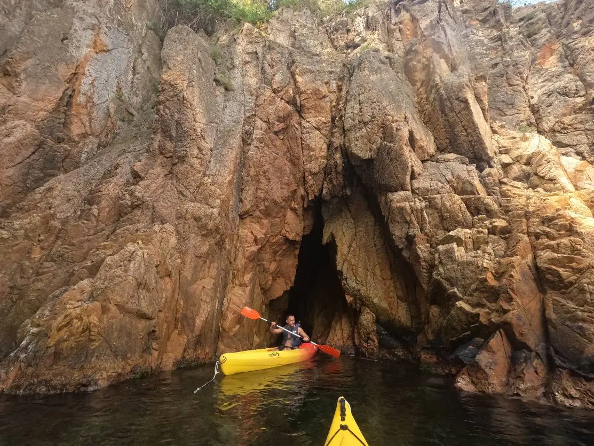
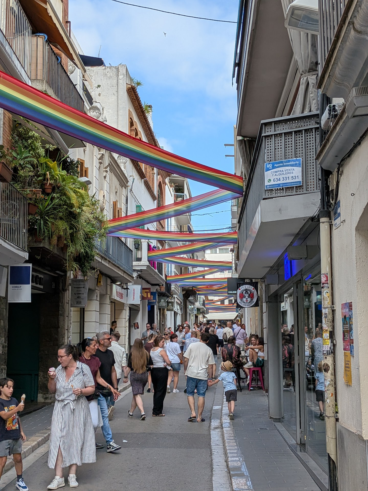

## Introduction
Barcelona was the reason of my entire eurotrip. Initially me, my brother and my father were going to Cusco for a week at the end of June to see the family and walk the short "Camino Inca", but then a professor from Barcelona that researched with my mom said that there was going to happen a congress in the beginning of June, and they were going to reserve a time to prestige her work and projects.

Luckily I had the exact time off from work to attend the congress and later meet my family in Cusco. So it started the 3 weeks trip from Europe until Peru.

## Congress
The congress, along with the short Camino Inca in Peru, was the only appointment I had in the entire vacation. I could (and wanted) to change destinations, hostels, tours, whatever, but those two were my responsability to attend.

It was the [Arquitectonics](https://www.arquitectonics.com/congreso-2025), based in the Universitat Politècnica de Catalunya. Half an hour from the congress was dedicated solely in memory of my mom, with her students from Brazil presenting projects in her research field. 

Was beautiful to see all students gathering in the meet call to attend the presentations. Before the presentations started the professor gave me the microphone for some words.

## Nightlife 

People always said that Barcelona was the nightlife for eurosummer and stuff, and indeed it was. Kudos to my hostel [Onefam](https://onefamhostels.com/paralelo-onefam-hostel-barcelona/) that everyday, Monday until Monday, had a schedule of a nice tour by the noon, and then bars and clubs by the night. 

During my stay in Barcelona, from Wednesday until Sunday, I went to the assigned bar and club everyday. There were mostly Europeans and foreigners like me enjoying the summer, was a great vibe but the music was not that good, mostly 2010's EDM.

One of the nights that has a special place in my memory was a day that the club was at the Barcelona beach, I don't remember the name of it, was a nice party, but the after that was really cool.

At the end of the party, I was with a Brazilian, an American, and a Brit, all of whom I met at the hostel. At around 3 am, we decided it was time to go back to the hostel, and I suggested, "Well, since we are here at the beach, we should at least take a walk along the shore." We all agreed, and in the end, we went for a swim in the Mediterranean Sea and got a bus/taxi back to the hostel, soaking wet :)

## Costa Brava and Pride
The start of this trip was great to engage in another perspective of living, in the sense that I was totally disconected of problems and just fully enjoying the moment. I never had so much energy in my life, and Costa Brava was a great example of that.

I was taking a flight to Italy on Monday at ~7 am. So, when I got back to the hostel at 4 am on Sunday, I was lying on the lobby's couch and thought, "Well, today is my last day, how should I enjoy it?" Then I remembered that a Brazilian friend I met at the hostel told me that she went kayaking in Costa Brava and that it was one of the most beautiful landscapes she had ever seen, so I thought I should go for it.

I checked some websites to schedule a tour, found one for 10 am, reserved it, and paid for it. Then I was about to go to sleep when it occurred to me, "Well, let's check where and when I need to be." I then realized that Costa Brava was a region ~80km north of Barcelona, there were no buses going there, and the meeting point was at the destination itself :)

So at 4:30 am, I reserved a rental car for 8 am at the airport. The plan was to wake up at 7 am, get an Uber there, and then drive for about an hour to Costa Brava to kayak for 2 hours :)

Was a really cool experience, and when I got back to Barcelona, the hostel people were warming up for getting into a pride parade that was 1h to the South of Barcelona, and well, I just went with them to fully enjoy my last day of Barcelona.

